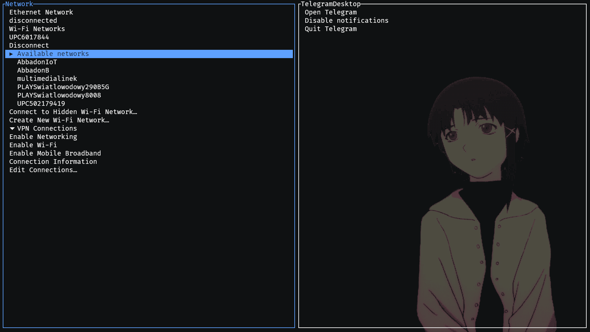

# tray-tui

[](https://search.nixos.org/packages?channel=unstable&query=tray-tui)
[](https://aur.archlinux.org/packages/tray-tui)

A **system tray implementation** for **terminal user interfaces (TUI)** using [ratatui](https://github.com/ratatui) and [system-tray](https://github.com/jakestanger/system-tray).

## **Overview**

tray-tui brings system tray functionality to the terminal, displaying **tray menus as interactive trees**. This allows for seamless navigation of **tray menu items and quick actions**, all within a TUI environment.

## **Features**

✅ **System tray integration** in a terminal
✅ **Interactive tree-based menu navigation**
✅ **Built using Rust and ratatui**

## **Installation**

### Arch linux

Available in AUR

```
yay -S tray-tui
```

```
paru tray-tui
```

### NixOS or Nix package manager
Available in nixpkgs:
```nix
environment.systemPackages = with pkgs; [
  tray-tui
];
```
As a flake:
```nix
inputs = {
  tray-tui.url = "github:Levizor/tray-tui";
};
```
```nix
environment.systemPackages = with pkgs; [
  inputs.tray-tui.packages.${system}.tray-tui
];
```

### Other

With cargo:

```
cargo install tray-tui
```

In case of failure, try to run

```
cargo install --locked tray-tui
```

## **Usage**

Run `tray-tui` in the terminal or optionally pass a path to config file `tray-tui -c $CONFIG`.

Use `hjkl` or `arrow keys` to navigate between menus.

Use `Shift-(J/K|Up/Down)` move focus between items inside menu.

`Enter` to activate.

`q/Ctrl-c` to exit.

You can configure the bindings.

## **Configuration**

Configuration file is located at `$XDG_CONFIG_HOME/tray-tui/config.toml`.
See all the configuration options in [example config](./config_example.toml).

## Showcase



## **License**

Project is licensed under [MIT](./LICENSE) license.
